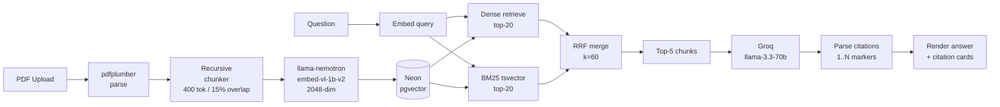

# DocLens — RAG Citation Engine

Upload a PDF, ask a question, get a grounded answer with numbered citations linking to exact pages and chunks with relevance scores.


    

---

## What it does

Upload a PDF and ask a question. DocLens retrieves the most relevant chunks using hybrid search — combining dense vector similarity and BM25 keyword matching — then generates an answer where every factual claim carries a `[1]`, `[2]` citation marker. Each marker links to a card showing the exact page number, chunk index, source filename, and a cosine similarity score. Built to demonstrate production RAG engineering: real retrieval metrics, a golden-dataset eval suite, and a system that abstains rather than hallucinating when the document doesn't contain the answer.

---

## Architecture



---

## Why hybrid search

BM25 handles keyword-heavy queries where exact token matches matter — searching for a product SKU, a person's name, or a specific clause number. Dense vectors handle semantic queries where the wording differs from the document text, like "what happens if I want to return something" matching a chunk about "30-day refund policy." Running both in parallel and merging with Reciprocal Rank Fusion covers queries that fall in either camp without having to choose upfront.

RRF merge formula: `score = Σ 1/(k + rankᵢ)` where k=60 (Cormack et al. 2009 default — prevents the top-ranked result from dominating when one retriever is confident and the other is not).

---

## Eval results

Measured against a 20-question golden dataset (15 in-scope, 5 out-of-scope) on a real uploaded PDF.

| Metric | Score |
|--------|-------|
| Retrieval Recall@5 | 0.667 (10/15) |
| Answer Faithfulness | 0.733 (11/15) |
| Citation Accuracy | 1.000 (20/20) |
| Abstention Rate | 1.000 (5/5) |

The retrieval recall gap (66.7%) traces to chunking boundary failures — sentences containing key facts were split across chunk boundaries and fell outside the overlap window, so neither chunk carried the full fact. Adding a cross-encoder reranker (`cross-encoder/ms-marco-MiniLM-L-6-v2`) over the top-20 candidates before passing to the LLM would recover these cases by re-scoring on the full query-chunk pair rather than relying solely on vector proximity.

---

## What breaks at scale

- **IVFFlat index degrades past ~1M vectors** — switch to HNSW (`CREATE INDEX USING hnsw`) which maintains sub-linear query time at the cost of higher build time and memory.
- **Synchronous ingestion blocks the request thread** — move parse → chunk → embed into an async queue (BullMQ or Inngest) so the upload endpoint returns immediately and the client polls for completion.
- **Embedding API latency at high volume** — batch chunks in groups of 32 (already implemented) and add a Redis cache keyed on content hash so re-uploaded documents skip the embedding call entirely.
- **Single Neon instance becomes a read bottleneck** — add read replicas and route all retrieval queries (`denseRetrieve`, `bm25Retrieve`) to the replica pool, keeping writes to the primary.

---

## Local setup

```bash
git clone https://github.com/Athertasium/doclens
cd doclens
bun install
```

Copy `.env.local.example` to `.env.local` and fill in the required values:

| Variable | Description |
|----------|-------------|
| `DATABASE_URL` | Neon PostgreSQL connection string |
| `NVIDIA_API_KEY` | NVIDIA API key for llama-nemotron-embed-vl-1b-v2 embeddings |
| `GROQ_API_KEY` | Groq API key for llama-3.3-70b-versatile generation |
| `LANGCHAIN_API_KEY` | LangSmith API key for tracing |
| `LANGCHAIN_TRACING_V2` | Set to `true` to enable LangSmith traces |
| `LANGCHAIN_PROJECT` | LangSmith project name (e.g. `doclens`) |
| `OPENAI_API_KEY` | OpenAI key — fallback embeddings only if NVIDIA key is absent |

Run the Prisma migration to create the schema:

```bash
bunx prisma migrate dev
```

The `embedding` and `tsv` columns use Postgres types Prisma doesn't natively support. After the migration, run these SQL statements once against your Neon database to enable pgvector and add the BM25 trigger:

```sql
-- Enable pgvector extension
CREATE EXTENSION IF NOT EXISTS vector;

-- Add tsvector GIN index
CREATE INDEX IF NOT EXISTS chunk_tsv_gin ON "Chunk" USING GIN (tsv);

-- Trigger to keep tsv column updated on insert/update
CREATE OR REPLACE FUNCTION chunk_tsv_trigger() RETURNS trigger AS $$
BEGIN
  NEW.tsv := to_tsvector('english', NEW.content);
  RETURN NEW;
END;
$$ LANGUAGE plpgsql;

CREATE TRIGGER chunk_tsv_update
  BEFORE INSERT OR UPDATE ON "Chunk"
  FOR EACH ROW EXECUTE FUNCTION chunk_tsv_trigger();
```

Start the dev server:

```bash
bun dev
```

Open [http://localhost:3000](http://localhost:3000), upload a PDF, and ask a question.
